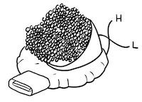
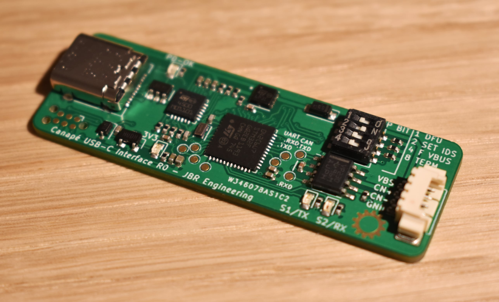

# Entreé USB-C CAN Interface

Entreé - like a Canapé but tastier...yes the logo is, and name was, Canapé but I didn't want to face a [Trademark](http://tmsearch.uspto.gov/bin/showfield?f=doc&state=4801:pgy4lj.2.5) dispute over an acute e for a hobby project...

The Entreé is a USB-C CAN interface. It is a variant of the open source [candleLight](https://github.com/HubertD/candleLight) platform and its many spawns. Not only does it add USB-C, it brings new features and CAN/USB controlled USB-PD for powering devices under test.



## Features

* Compatiable with:
    * gs_usb firmware [candleLight_fw](https://github.com/candle-usb/candleLight_fw); Linux mainline native support.
    * [PCAN cantact](https://github.com/moonglow/pcan_cantact); (Windows) PCAN software support.
    * [slcan cantact](https://github.com/normaldotcom/cantact-fw); Linux CAN over USART/CDC.
* USB-C connection for use with modern hardware.
* USB-PD negotiation for powering devices rather than using USB communication interface. Up-to 20 V/1 A can be requested and supplied to a device.
* Switched control of 120 Ω termination resistor.
* Switched control of DFU mode and TagConnect 6-pin ISP for use as a development tool.
* USB-PD profile and device setup using switched internal CAN IDs.
* USART test points for SLCAN without USB.
* Two signal connector choices.
* Small form factor: 55 x 18.5 mm.
* Silkscreen art 🎨!

# Purchase

* [JBR Engineering shop](https://shop.jbrengineering.co.uk/product/entree-usb-c-to-can-interface-with-usb-pd/).
* [Tindie](https://www.tindie.com/products/22440/)

# Usage

## Hardware Connection

The primary CAN connection is a [Molex Picoblade _53261-0471_](https://www.digikey.ch/products/en?keywords=WM7622CT-ND).

The connector was selected because they are commonly used on Drones and so Picoblade to 0.1" header cables can also be easily obtained:

* [1 Bit Sqaured Black Magic 0.1" female cable](https://1bitsquared.com/products/black-magic-01in-pin-header-serial-cable).

Alternatively, one can obtain [pre-crimped female cable assemblies _15134-0402_](https://www.digikey.ch/product-detail/en/molex/0151340402/WM15258-ND/6198148) or [female 4-pin housing _51021-04_](https://www.digikey.ch/product-detail/en/molex/0510210400/WM1722-ND/242844) for custom cabling.

A secondary unfitted [_JST SM04B_](https://www.digikey.ch/products/en?keywords=455-1804-1-ND) (otherwise known as Qwiic/STEMMA) footprint is available on the bottom of the board if one wishes to use those [commonly available cables](https://www.adafruit.com/category/619) instead. JST pre-crimped part is _A04SR04SR30K152A_.

### Wiring Example

Below is a wiring example showing the Entreé Picoblade and JST pinout. A Black Magic 0.1" female header cable is connected to the Picoblade and standard STEMMA QT connected to the secondary JST header. **Note both cable colouring is non-standard due to optimal board layout**.


## Software

A [Vagrant](https://www.vagrantup.com/) virtual machine environment is provided in the ./linux-vm folder for those on non-Linux hosts or who want a pre-configured environment. Install Vagrant and VirtualBox and then setup the machine from within the ./linux-vm folder with the `vagrant up` command.

### Linux SocketCAN

Entreé comes with _candleLight_ firmware which is intended for use with a Linux host. Most Linux distributions include the gs_usb driver and can kernel modules by default so getting started is very easy.

#### Create CAN network interface [[ref]](https://elinux.org/Bringing_CAN_interface_up)

```
sudo ip link set can0 type can bitrate BIT_RATE # where BIT_RATE is the CAN bus speed in b/s
sudo ip link set up can0
```

#### CLI

Install `can-utils` using one's package manager and then various command line tools are available.

```
cansend can0 999#DEADBEEF   # Send a frame to 0x999 with payload 0xdeadbeef
candump can0                # Show all traffic received by can0
canbusload can0 500000      # Calculate bus loading percentage on can0
cansniffer can0             # Display top-style view of can traffic
cangen can0 -D 11223344DEADBEEF -L 8    # Generate fixed-data CAN messages
```

See the [can-utils README](https://github.com/linux-can/can-utils/blob/master/README.md) for more.

#### Cangaroo GUI

The Cangaroo GUI can be compiled for Linux hosts. See [Cangaroo](https://github.com/normaldotcom/cangaroo/).

### Windows

To use the default _candleLight_ firmware on Windows, one can use [Cangaroo](https://github.com/normaldotcom/cangaroo/): [Pre-compiled Win32 binary](https://www.dropbox.com/s/dyh9gvt572v8nhn/cangaroo-win32-0363ce7.zip?dl=0).

The _PCAN\_cantact_ firmware can be used with the [PCAN software suit](https://www.peak-system.com/Software.68.0.html?&L=1) and [Python](#python) modules.

Alternatively, to use [SocketCAN](#linux-socketcan) one can use the pre-configured virtual machine explained at the start of the [Software section](#software).

### Python

The [python-can](https://python-can.readthedocs.io/en/master/#) module supports _SocketCAN_ (candleLight), _slcan_ and _PCAN_ devices so options for all hosts are covered - see the [configuration page](https://python-can.readthedocs.io/en/master/configuration.html).

Paired with the [cantools](https://pypi.org/project/cantools/) module, one has access to powerful CLI tools and scripting for CAN bus operations including use with database definition files.

Both modules are pre-installed in the Vagrant virtual machine.

## DIP Switches

The 4 bit DIP switch sets unique runtime settings when in the 'ON' position; for normal usage as a CAN bus probe these would be 'OFF'.

| Switch | Decimal | Set Action                                                    |
|--------|---------|---------------------------------------------------------------|
| 1      | 1       | Force bootloader for DFU.                                     |
| 2      | 2       | Enable Entreé internal configuration CAN IDs.                 |
| 3      | 4       | Enable VBUS -> VBS always not just when USB-PD profile valid. |
| 4      | 8       | Enable 120 ohm CAN\_H/CAN\_L termination resistor               |

**NOTE** both DFU and 'Enable VBUS' will require power cycling the device for the change to be reflected.

## USB Power Delivery (USB-PD)

The on-board USB-C controller (STUSB4500) is configured for 5 V / 1A power delivery by default (PDO 2). One can configure the controller using the below CAN bus commands when using the [**candleLight_fw**](https://github.com/tuna-f1sh/candleLight_fw) fork and with the [internal CAN IDs switch](#dip-switches) set.
Please refer to the [**candleLight_fw Entreé fork**](https://github.com/tuna-f1sh/candleLight_fw) README for usage.

## Firmware

* [**candleLight_fw Entreé fork**](https://github.com/tuna-f1sh/candleLight_fw) - [[BIN DOWNLOAD]](./bin/entree_fw.bin): Default firmware shipping with Entreé. Works with [Linux SocketCAN](#linux-socketcan) and the [Cangaroo](#cangaroo-gui) GUI. Includes support for configuration of the on-board STUSB4500 USB-C controller and DFU without setting DIP switch.
* [**PCAN CANtact**](https://github.com/tuna-f1sh/pcan_cantact/tree/hsi48) - [[BIN DOWNLOAD]](./bin/pcan_entree_hw.bin): Open source PCAN compatible firmware; works like a PCAN USB adaptor with the PCAN software suite and python-can module. Does not include USB-PD configuration or DFU.
* [**cantact_slcan**](https://github.com/normaldotcom/cantact-fw): slcand is a USART CAN daemon for Linux, which emulates a CAN network socket over USART. The pre-cursor of the candleLight_fw and gs_usb driver, it offers no real advantage since it is still over USB as a CDC. I've found it to drop frames at common bus rates and so do not recommend it. USART pins are exposed however if one wishes to play with slcan over physical USART. A virtual network interface can be created: `sudo slcand -o -s8 -t hw -S 3000000 /dev/ttyS0` and then used like a [SocketCAN](#linux-socketcan) interface.

### Update

Enable the DFU [DIP switch](#dip-switches) and then issue the following command with [`dfu-util`](http://dfu-util.sourceforge.net/):

```
sudo dfu-util -d 0483:df11 -c 1 -i 0 -a 0 -s 0x08000000 -D $FIRMWARE_FILE.bin
```

Where `$FIRMWARE_FILE.bin` is the firmware file to be updated. Binaires are stored in the './bin' folder of this repository, so to flash:

```
sudo dfu-util -d 0483:df11 -c 1 -i 0 -a 0 -s 0x08000000 -D ./bin/entree_fw.bin # candleLight_fw
sudo dfu-util -d 0483:df11 -c 1 -i 0 -a 0 -s 0x08000000 -D ./bin/pcan_entree_hw.bin # pcan_cantact
```

There is also a [Web DFU tool](https://devanlai.github.io/webdfu/dfu-util/), which does not require `dfu-util`. The only requirement is the Chrome browser. Use these settings:

* Vendor ID: **0x0483**
* Transfer Size: **2048**

# Credits

The open source CAN community is large and this project adds to that in the true spirit of open source. The [canable](canable.io) devices (of which I have many!) started me on my journey into CAN hardware and software development. Entreé fixes areas I felt could be improved upon and brought up-to date.

Please find links below to projects that have supported the development of the open source CAN ecosystem.

* [canable.io](canable.io)
* [CANtact](https://wiki.linklayer.com/index.php/CANtact)
* [candleLight](https://github.com/HubertD/candleLight)
* [candleLight_fw](https://github.com/candle-usb/candleLight_fw)
* [SocketCAN user space utilities](https://github.com/linux-can/can-utils)
* [Linux slcan module](https://github.com/torvalds/linux/blob/master/drivers/net/can/slcan.c)
* [Linux gs_usb module](https://github.com/torvalds/linux/blob/master/drivers/net/can/usb/gs_usb.c)
* [python-can Python module](https://python-can.readthedocs.io/en/master/)

Should get you started down the rabbit hole!

---

[JBR Engineering Research Ltd](https://jbrengineering.co.uk)
