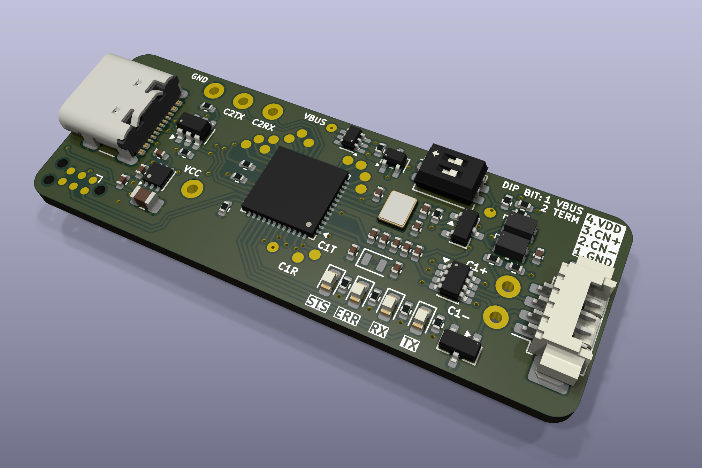
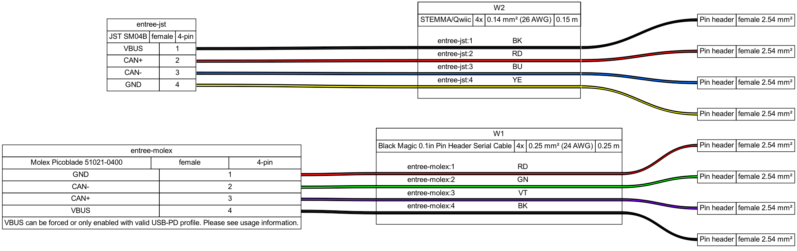

# Entrée USB-C CAN Interface

The Entrée is a USB-C CAN/CAN FD (up to 8 Mbit/s) interface, designed to be fully feature-compatible with the [CANnectivity firmware](https://github.com/tuna-f1sh/cannectivity) firmware and Linux SocketCAN.

Entrée - like a Canapé but tastier...yes the logo is, and name was, Canapé but I didn't want to face a [Trademark](http://tmsearch.uspto.gov/bin/showfield?f=doc&state=4801:pgy4lj.2.5) dispute over an acute e for a hobby project...



## Features

* Compatiable with [CANnectivity firmware](https://github.com/tuna-f1sh/cannectivity); Zephyr based gs_usb.
* USB-C connection for use with modern hardware.
* Sotware and hardware switched control of 120 Ω termination resistor.
* Sotware and hardware switched control of VBUS to VDD connection for powering from USB.
* USB DFU and TagConnect 6-pin ISP for use as a development tool.
* FDCAN2 test points that with external transceiver can be used for a second CAN channel.
* USART test points for SLCAN without USB.
* Alternative JST SM04B (Qwiic/STEMMA) connector footprint for use with commonly available cables.
* Silkscreen art 🎨!
* [3d printed case](https://www.printables.com/model/681455-entree-usb-c-can-interface-case)

# Purchase

* [Tindie](https://www.tindie.com/products/22440/)

# Usage

> [!NOTE]
> The README has been updated for Entrée V2 which has a different hardware design to the original V1. The V1 supported candleLightFW and had USB-PD. The original V1 design is still available on the [V1 tag](https://github.com/tuna-f1sh/entree/commits/V1)

## Hardware Connection

The primary CAN connection is a [Molex Picoblade _53261-0471_](https://www.digikey.ch/products/en?keywords=WM7622CT-ND).

The connector was selected because they are commonly used on Drones and so Picoblade to 0.1" header cables can also be easily obtained:

* [1 Bit Sqaured Black Magic 0.1" female cable](https://1bitsquared.com/products/black-magic-01in-pin-header-serial-cable).

Alternatively, one can obtain [pre-crimped female cable assemblies _15134-0402_](https://www.digikey.ch/product-detail/en/molex/0151340402/WM15258-ND/6198148) or [female 4-pin housing _51021-04_](https://www.digikey.ch/product-detail/en/molex/0510210400/WM1722-ND/242844) for custom cabling.

A secondary unfitted [_JST SM04B_](https://www.digikey.ch/products/en?keywords=455-1804-1-ND) (otherwise known as Qwiic/STEMMA) footprint is available on the bottom of the board if one wishes to use those [commonly available cables](https://www.adafruit.com/category/619) instead. JST pre-crimped part is _A04SR04SR30K152A_.

### Wiring Example

Below is a wiring example showing the Entrée Picoblade and JST pinout. A Black Magic 0.1" female header cable is connected to the Picoblade and standard STEMMA QT connected to the secondary JST header. **Note both cable colouring is non-standard due to optimal board layout**.



## Software

A [Vagrant](https://www.vagrantup.com/) virtual machine environment is provided in the ./linux-vm folder for those on non-Linux hosts or who want a pre-configured environment. Install Vagrant and VirtualBox and then setup the machine from within the ./linux-vm folder with the `vagrant up` command.

### Linux SocketCAN

Entrée comes with _CANnectivity_ firmware which is intended for use with a Linux host. Most Linux distributions include the gs_usb driver and can kernel modules by default so getting started is very easy.

The below assume a single CAN interface is present with default name `can0` - if multiple interfaces are present then the name may be different and can be found with `ip link`.

#### Create CAN network interface [[ref]](https://elinux.org/Bringing_CAN_interface_up)

```
sudo ip link set can0 type can bitrate BIT_RATE # where BIT_RATE is the CAN bus speed in b/s
sudo ip link set up can0
```

#### Control Termination Resistor

```
sudo ip link set dev can0 type can termination 0  # Disable termination resistor on can0
sudo ip link set dev can0 type can termination 120 # Enable 120 ohm termination resistor on can0
```

#### Print Interface Help

```
ip link set can0 type can help
ip -details -statistics link show can0 # Show detailed information about can0 including termination resistor status
```

#### CLI

Install `can-utils` using one's package manager and then various command line tools are available.

```
cansend can0 999#DEADBEEF   # Send a frame to 0x999 with payload 0xdeadbeef
candump can0                # Show all traffic received by can0
canbusload can0 500000      # Calculate bus loading percentage on can0
cansniffer can0             # Display top-style view of can traffic
cangen can0 -D 11223344DEADBEEF -L 8    # Generate fixed-data CAN messages
```

See the [can-utils README](https://github.com/linux-can/can-utils/blob/master/README.md) for more.

#### Cangaroo GUI

The Cangaroo GUI can be compiled for Linux hosts. See [Cangaroo](https://github.com/normaldotcom/cangaroo/).

### Windows

To use the default firmware on Windows, one can use [Cangaroo](https://github.com/normaldotcom/cangaroo/): [Pre-compiled Win32 binary](https://www.dropbox.com/s/dyh9gvt572v8nhn/cangaroo-win32-0363ce7.zip?dl=0).

Alternatively, to use [SocketCAN](#linux-socketcan) one can use the pre-configured virtual machine explained at the start of the [Software section](#software).

### Python

The [python-can](https://python-can.readthedocs.io/en/master/#) module supports 'socketcan' (Linux host) and 'gs_usb' interfaces so options for all hosts are covered - see the [configuration page](https://python-can.readthedocs.io/en/master/configuration.html).

Paired with the [cantools](https://pypi.org/project/cantools/) module, one has access to powerful CLI tools and scripting for CAN bus operations including use with database definition files.

Both modules are pre-installed in the Vagrant virtual machine.

## DIP Switches

> [!NOTE]
> The DIP switches override software control.


| Switch | Decimal | Set Action                                                    |
|--------|---------|---------------------------------------------------------------|
| 1      | 1       | Enable VBUS -> VDD.                                           |
| 2      | 2       | Enable 120 ohm CAN\_H/CAN\_L termination resistor             |


---

[JBR Engineering Research Ltd](https://jbrengineering.co.uk)
